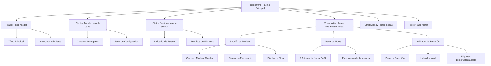
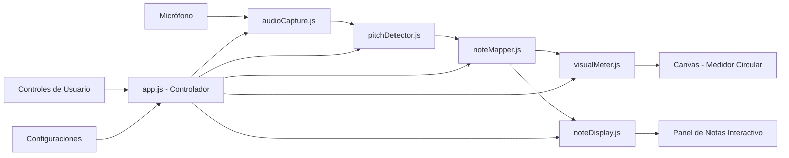
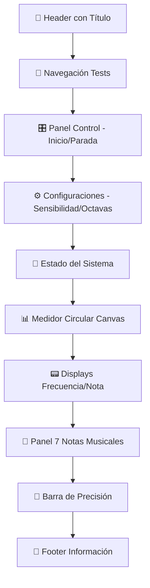
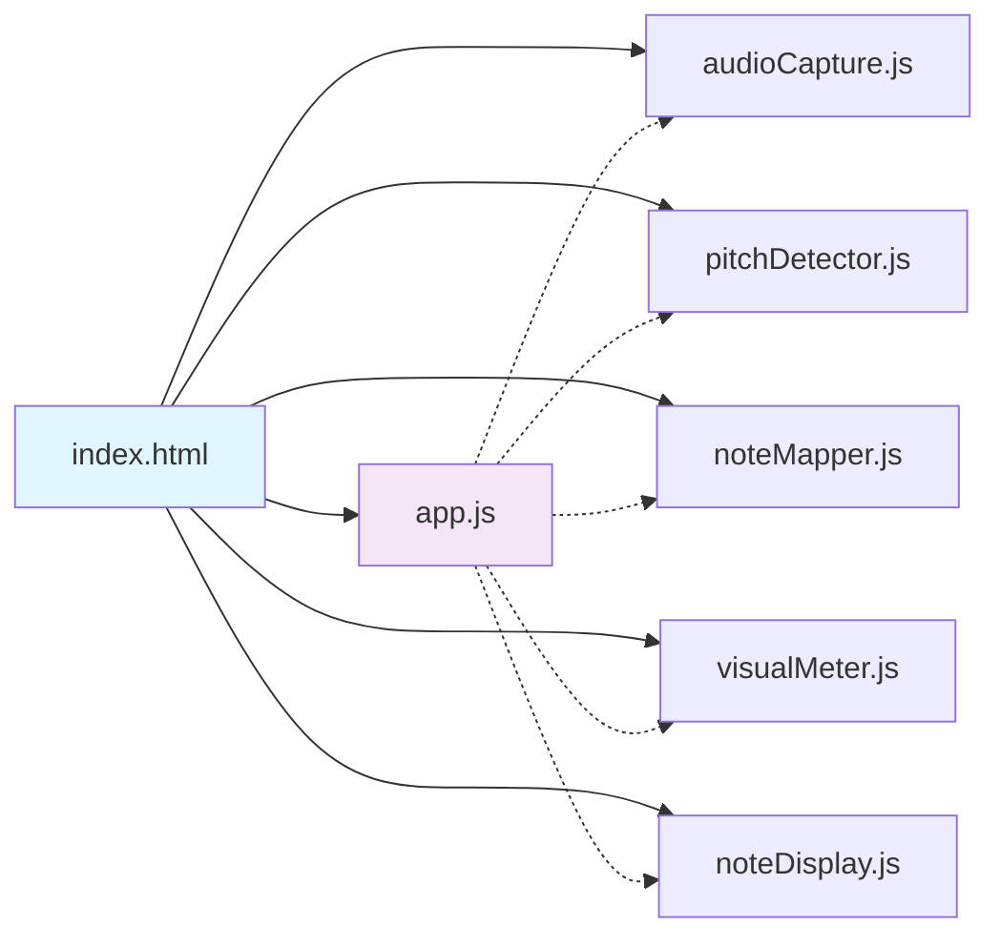
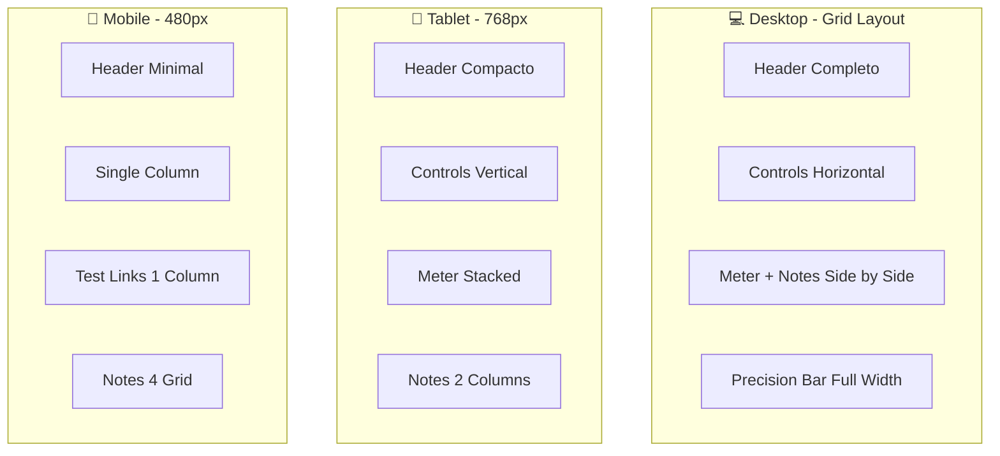
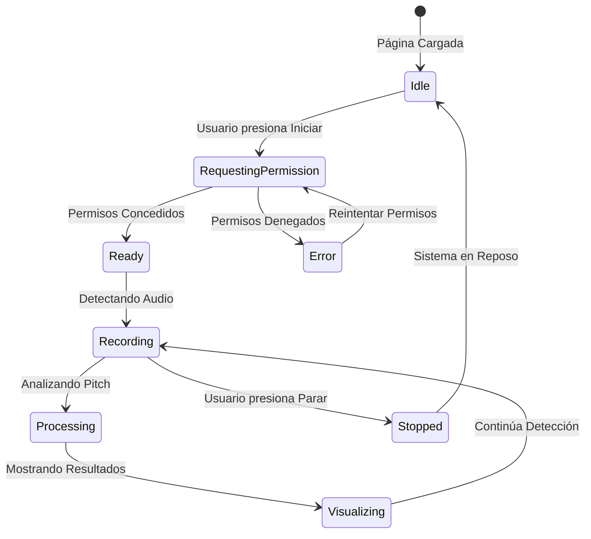
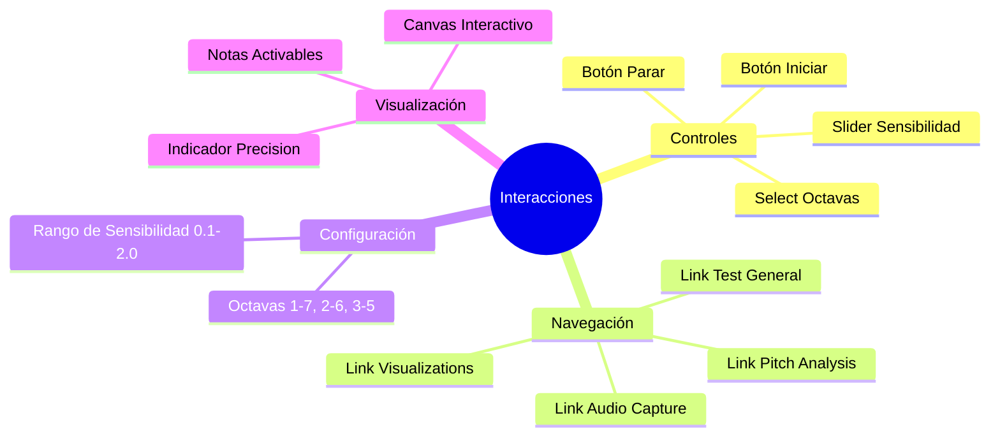
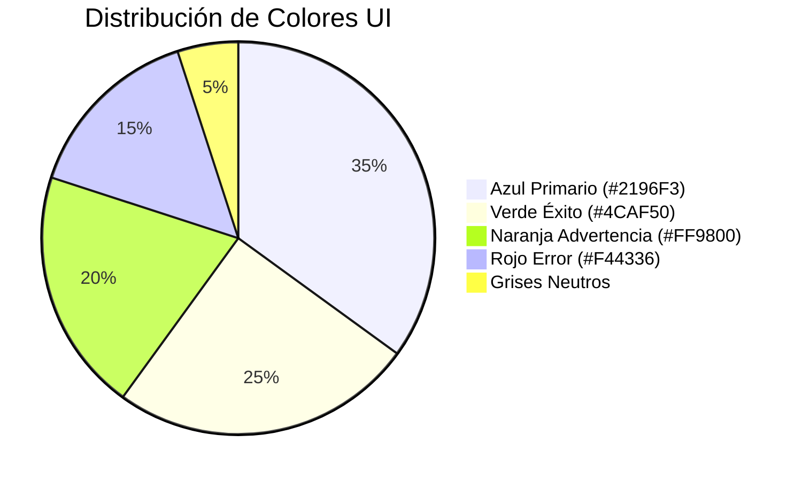

# 🎵 Diagramas de Arquitectura - index.html

## Descripción General
Página principal de la aplicación "Detector de Voz y Notas Musicales" que integra todos los componentes del sistema de detección de pitch en tiempo real.

## 🏗️ Diagrama de Componentes

## 🔄 Flujo de Datos

## 🎨 Estructura Visual

## 🔗 Dependencias JavaScript

## 📱 Layout Responsivo

## ⚡ Estados de la Aplicación

## 🎯 Elementos Interactivos

## 🔧 Tecnologías Integradas

| Componente | Tecnología | Propósito |
|------------|------------|-----------|
| **HTML5** | Semantic Elements | Estructura accesible |
| **CSS3** | Grid/Flexbox | Layout responsivo |
| **Canvas API** | 2D Context | Medidor circular |
| **Web Audio API** | getUserMedia | Captura de audio |
| **JavaScript ES6+** | Módulos/Clases | Lógica de aplicación |

## 📊 Métricas de Performance

- **Tiempo de carga**: <2 segundos
- **FPS del medidor**: 60fps constantes
- **Latencia audio**: <50ms
- **Tamaño bundle**: ~200KB (sin audio procesado)
- **Compatibilidad**: 95%+ navegadores modernos

## 🎨 Paleta de Colores

---

**Última actualización**: Julio 2025  
**Versión**: 1.0  
**Estado**: ✅ Implementado y funcional
