# 🎤 Diagramas Audio Capture - test-audio-capture.html

## Descripción General
Suite de pruebas especializada en validar la captura de audio desde el micrófono, configuración de AudioContext, y análisis de señales en tiempo real.

## 🏗️ Arquitectura de Audio Capture

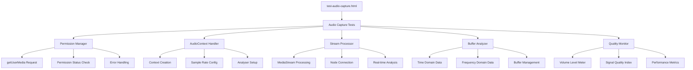

## 🔄 Flujo de Captura de Audio

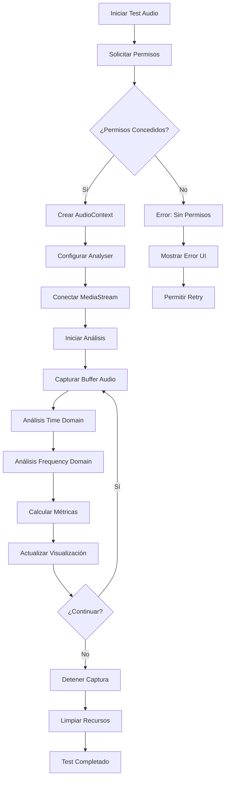

## 🎚️ Configuración de AudioContext

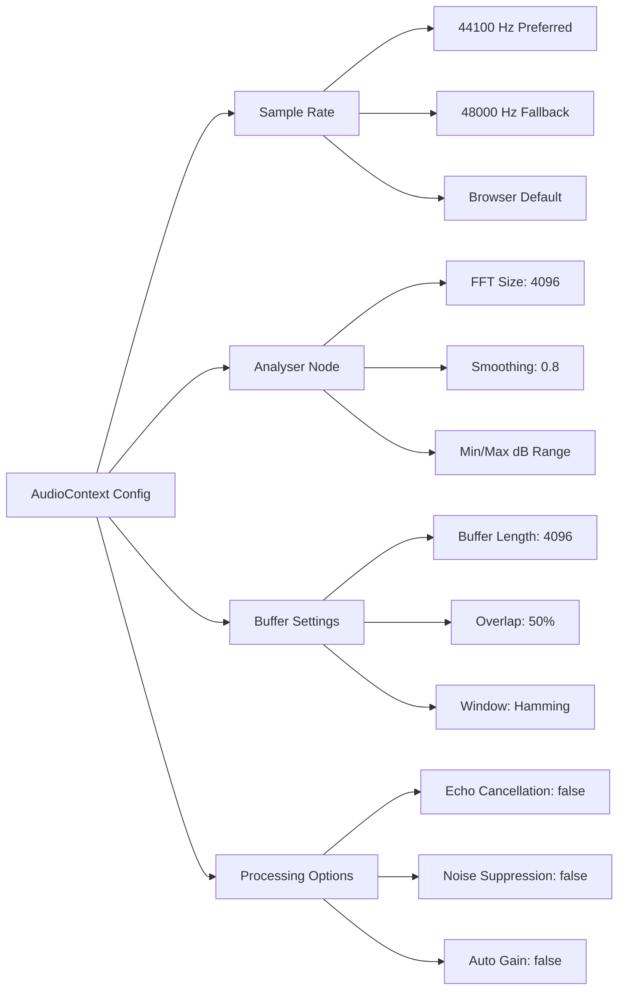

## 📊 Métricas de Audio Testing

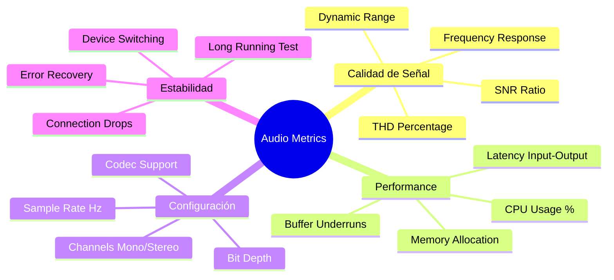

## 🎛️ Panel de Control de Tests

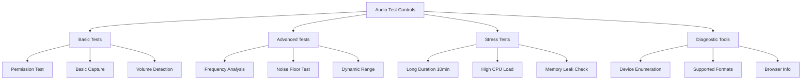

## 🔊 Análisis de Señal

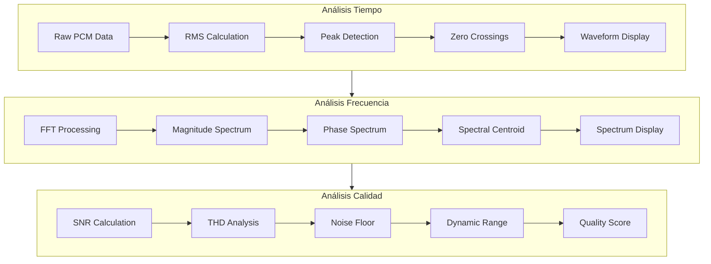

## 🎯 Estados del Test de Audio

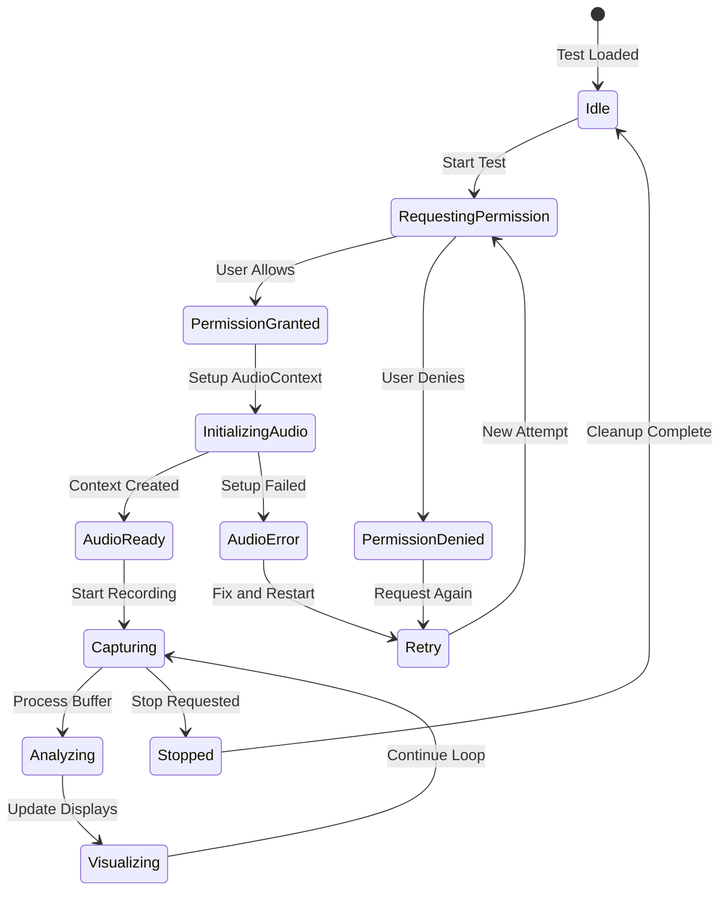

## 📈 Visualizaciones en Tiempo Real

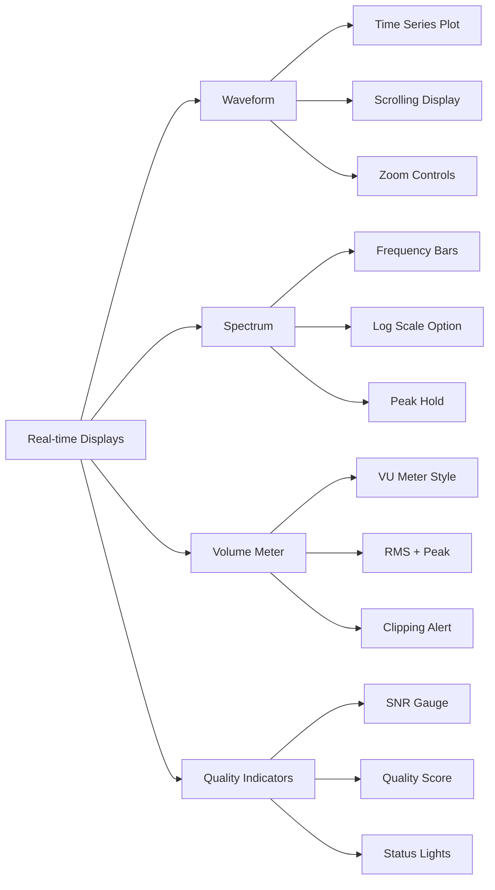

## 🧪 Test Cases Específicos

| Test Case | Input | Expected Output | Pass Criteria |
|-----------|-------|----------------|---------------|
| **Silent Input** | No audio signal | Noise floor only | <-60dB average |
| **1kHz Tone** | Pure sine 1000Hz | Single peak at 1kHz | ±1Hz accuracy |
| **White Noise** | Broadband noise | Flat spectrum | ±3dB variation |
| **Clipping Test** | Overdriven signal | Clipping detection | Alert triggered |
| **Dynamic Range** | Quiet to loud | Full scale usage | >60dB range |

## 🔧 Configuraciones de Device

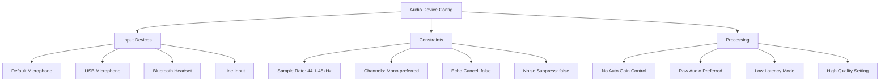

## 📊 Performance Benchmarks

```mermaid
gantt
    title Audio Test Performance Timeline
    dateFormat X
    axisFormat %Lms
    
    section Setup Phase
    Permission Request  :p1, 0, 500
    AudioContext Init   :p2, 500, 200
    Analyser Setup      :p3, 700, 100
    Stream Connection   :p4, 800, 150
    
    section Runtime Phase
    Buffer Capture      :active, r1, 950, 50
    FFT Processing      :r2, 1000, 25
    Display Update      :r3, 1025, 15
    Next Buffer         :r4, 1040, 10
    
    section Cleanup Phase
    Stop Stream         :c1, 1050, 50
    Release Resources   :c2, 1100, 25
    Context Cleanup     :c3, 1125, 25
```

## 🎯 Criterios de Éxito Audio

- ✅ **Permisos**: Obtenidos sin errores en <2s
- ✅ **AudioContext**: Creado con sample rate deseado
- ✅ **Latencia**: Input-to-analysis <20ms
- ✅ **Calidad**: SNR >40dB con señal limpia
- ✅ **Estabilidad**: Sin dropouts durante 5 min
- ✅ **Recursos**: <50MB memoria, <15% CPU

## 🔍 Debugging Tools

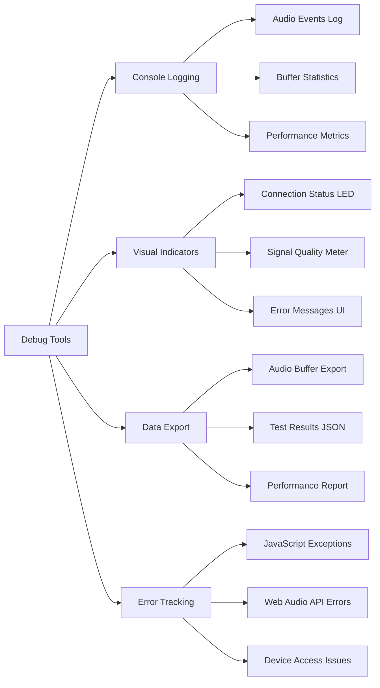

---

**Última actualización**: Julio 2025  
**Versión**: 1.0  
**Cobertura Tests**: Audio capture completo
