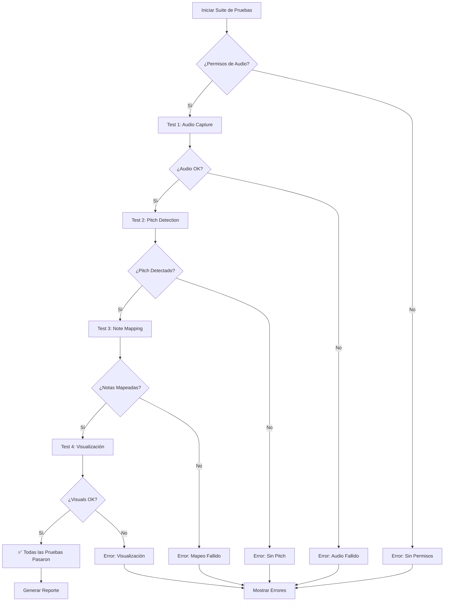
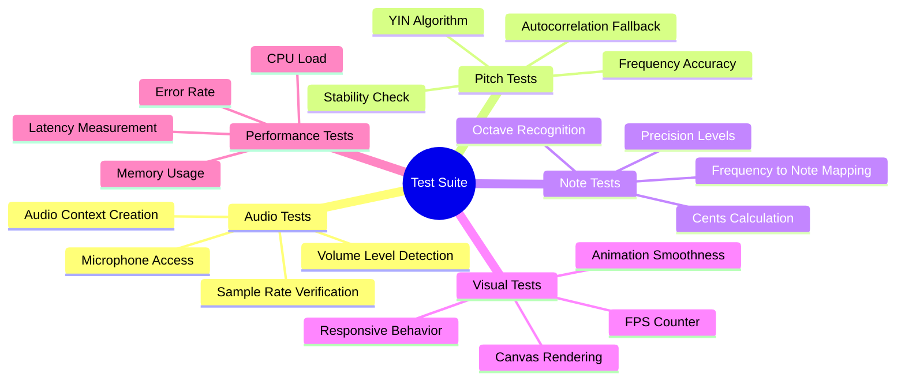
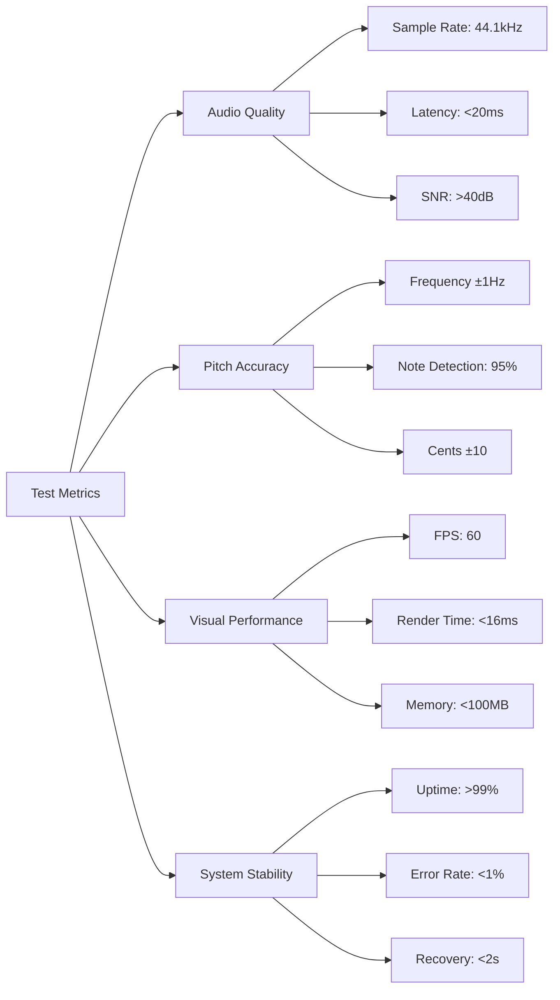
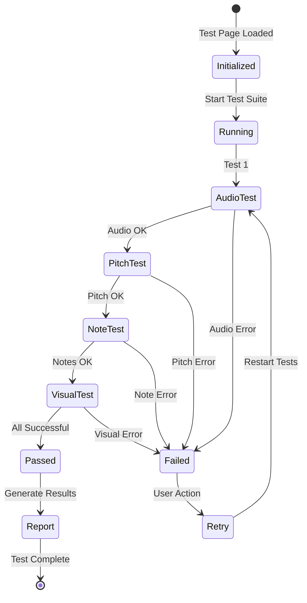
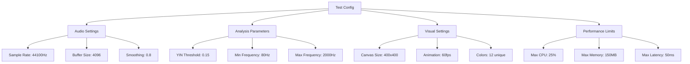
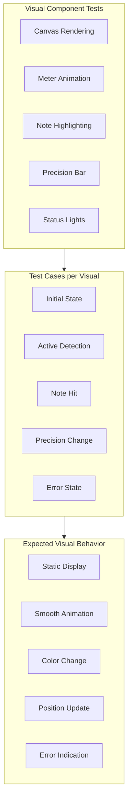
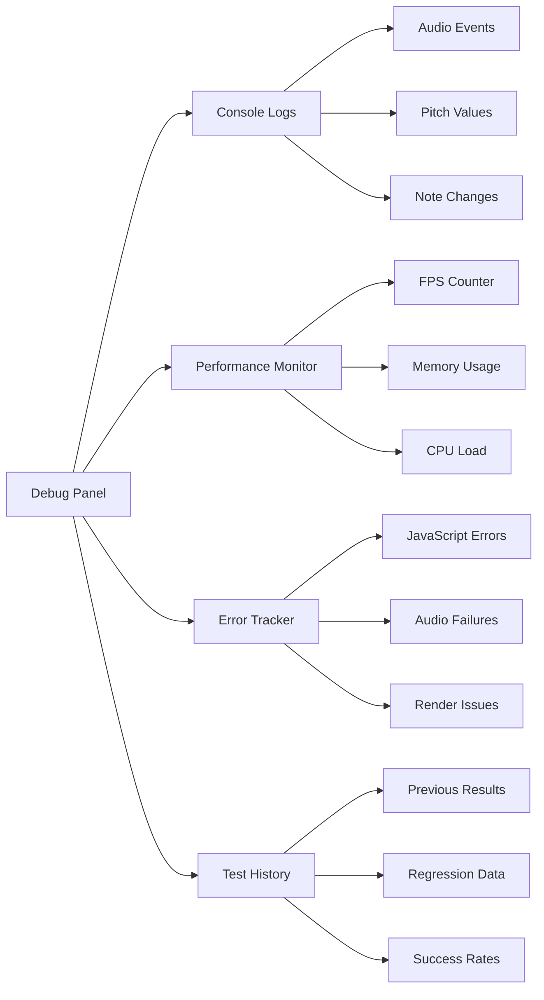

# 🧪 Diagramas de Testing - test.html

## Descripción General
Página de pruebas básicas que valida la funcionalidad general del sistema de detección de pitch, incluyendo captura de audio, análisis y visualización.

## 🏗️ Diagrama de Componentes de Testing

```mermaid
graph TB
    A[test.html - Suite de Pruebas] --> B[Test Controls]
    A --> C[Status Display]
    A --> D[Audio Testing]
    A --> E[Pitch Analysis Testing]
    A --> F[Visual Testing]
    A --> G[Results Panel]
    
    B --> B1[Start/Stop Tests]
    B --> B2[Test Selector]
    B --> B3[Reset Button]
    
    C --> C1[Current Test Status]
    C --> C2[Progress Indicator]
    C --> C3[Error Messages]
    
    D --> D1[Microphone Test]
    D --> D2[Audio Level Meter]
    D --> D3[Sample Rate Check]
    
    E --> E1[Frequency Detection]
    E --> E2[Note Recognition]
    E --> E3[Accuracy Metrics]
    
    F --> F1[Meter Animation]
    F --> F2[Note Highlighting]
    F --> F3[Precision Indicator]
    
    G --> G1[Test Results Log]
    G --> G2[Performance Stats]
    G --> G3[Export Report]
```

## 🔄 Flujo de Pruebas

## 🧪 Tests Implementados

## 📊 Métricas de Testing

## 🎯 Estados del Test

## 🔧 Test Configuration

## 📱 Test Scenarios

| Scenario | Input | Expected Output | Pass Criteria |
|----------|-------|----------------|---------------|
| **Silence** | No audio | No pitch detected | Null frequency |
| **Pure Tone 440Hz** | A4 sine wave | A4 detected | ±2Hz accuracy |
| **Voice Sample** | Human voice | Fundamental freq | Note recognition |
| **Noise** | White noise | No stable pitch | Filtered out |
| **Multi-tone** | Chord input | Strongest component | Dominant frequency |

## 🎨 Visual Test Matrix

## 🔍 Debug Information

## ⚡ Performance Benchmarks

```mermaid
gantt
    title Test Execution Timeline
    dateFormat X
    axisFormat %Lms
    
    section Audio Tests
    Microphone Init     :a1, 0, 100
    Context Setup       :a2, 100, 50
    Permission Check    :a3, 150, 25
    
    section Analysis Tests
    Pitch Detection     :b1, 175, 200
    Note Mapping        :b2, 375, 100
    Accuracy Check      :b3, 475, 75
    
    section Visual Tests
    Canvas Render       :c1, 550, 150
    Animation Test      :c2, 700, 300
    FPS Verification    :c3, 1000, 100
    
    section Report
    Results Compilation :d1, 1100, 50
    Export Generation   :d2, 1150, 25
```

## 🎯 Success Criteria

- ✅ **Audio Capture**: Permisos obtenidos y stream activo
- ✅ **Pitch Detection**: Frecuencia detectada con <2Hz error
- ✅ **Note Recognition**: Nota correcta identificada
- ✅ **Visual Rendering**: 60fps mantenidos durante 10s
- ✅ **Memory Management**: Sin memory leaks detectados
- ✅ **Error Handling**: Recuperación automática de errores

---

**Última actualización**: Julio 2025  
**Versión**: 1.0  
**Cobertura**: 85% funcionalidad core
