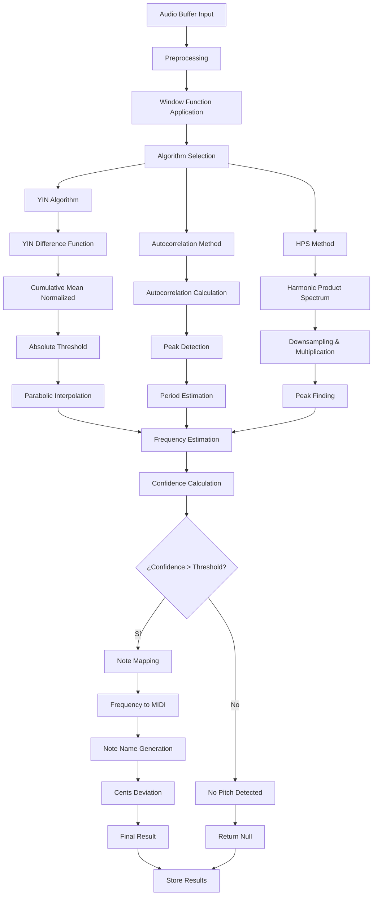
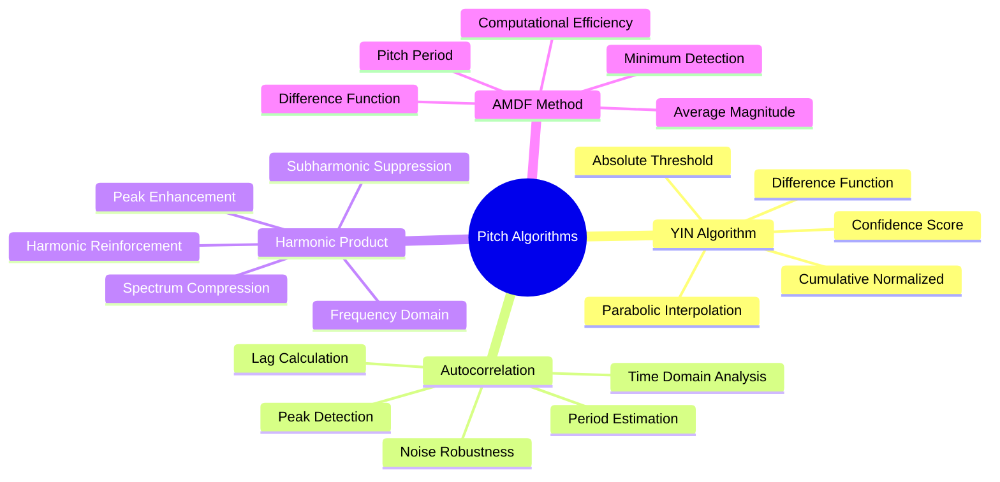
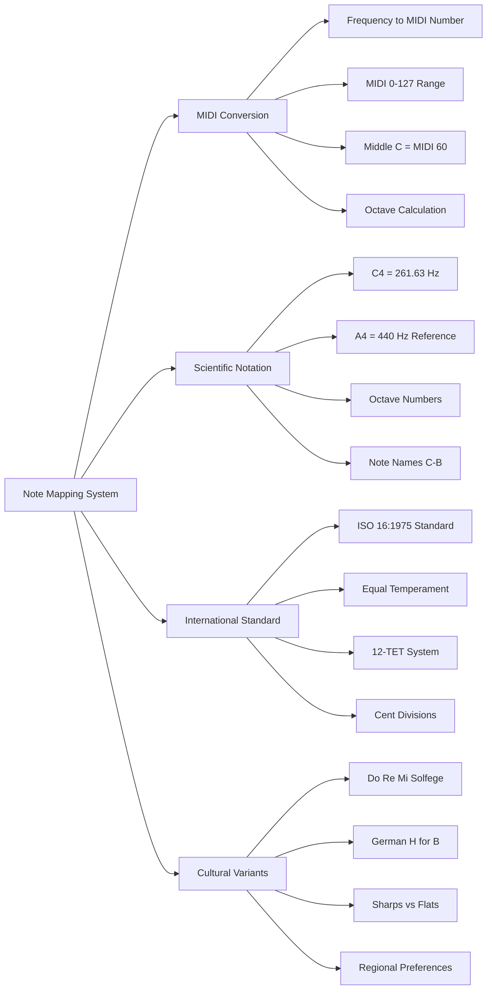
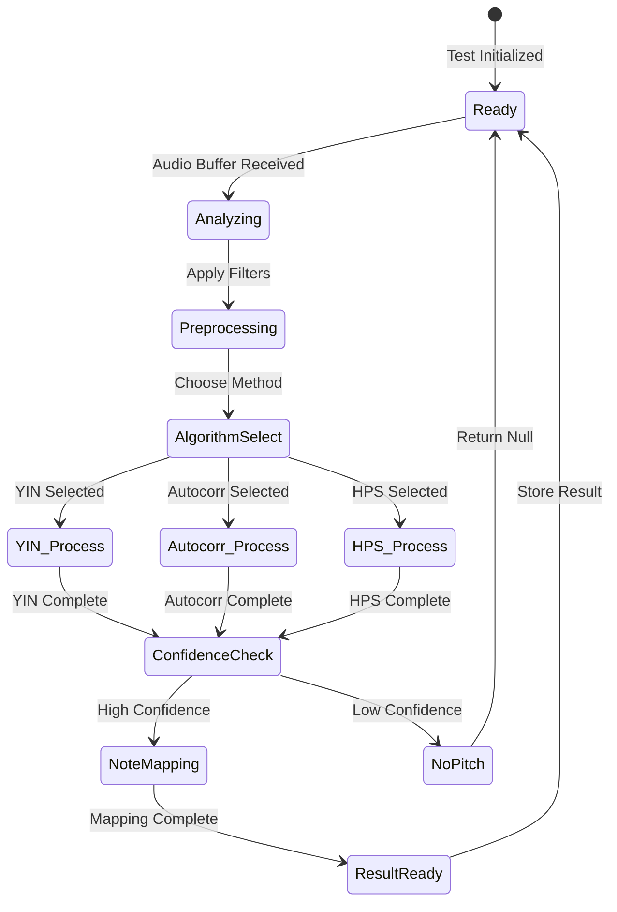
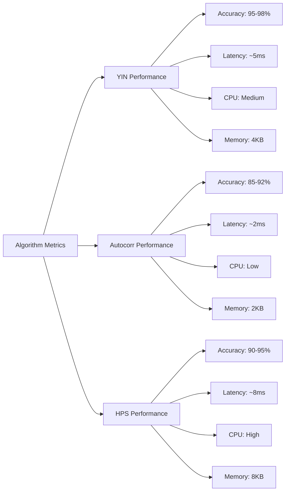
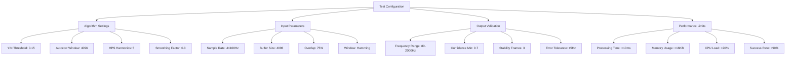
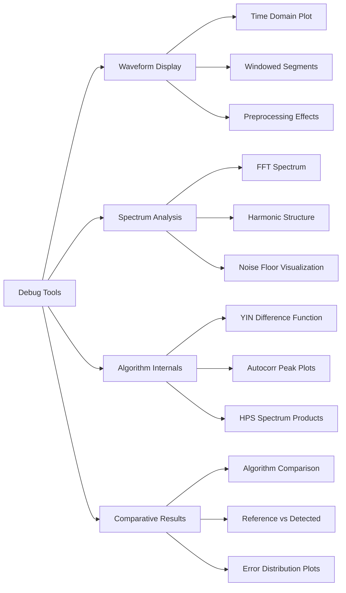

# 🎵 Diagramas Pitch Analysis - test-pitch-analysis.html

## Descripción General
Suite especializada para validar algoritmos de detección de pitch, incluyendo YIN algorithm, autocorrelación, mapeo de notas y cálculo de precisión en cents.

## 🏗️ Arquitectura de Análisis de Pitch

```mermaid
graph TB
    A[test-pitch-analysis.html] --> B[Pitch Detection Engine]
    
    B --> C[Algorithm Selector]
    B --> D[Signal Preprocessor]
    B --> E[Pitch Detectors]
    B --> F[Note Mapper]
    B --> G[Accuracy Analyzer]
    
    C --> C1[YIN Algorithm]
    C --> C2[Autocorrelation]
    C --> C3[HPS Method]
    C --> C4[AMDF Algorithm]
    
    D --> D1[Windowing Hamming]
    D --> D2[Pre-emphasis Filter]
    D --> D3[Noise Gate]
    D --> D4[DC Removal]
    
    E --> E1[Fundamental Frequency]
    E --> E2[Confidence Score]
    E --> E3[Harmonic Analysis]
    E --> E4[Pitch Stability]
    
    F --> F1[Frequency to Note]
    F --> F2[Octave Detection]
    F --> F3[Cents Calculation]
    F --> F4[Enharmonic Handling]
    
    G --> G1[Reference Comparison]
    G --> G2[Error Statistics]
    G --> G3[Precision Metrics]
    G --> G4[Confidence Analysis]
```



## 🔄 Flujo de Análisis de Pitch



## 🎯 Algoritmos de Detección Implementados



## 📊 Test de Precisión por Algoritmo

```mermaid
graph TD
    A[Precision Testing] --> B[Synthetic Signals]
    A --> C[Real Audio Samples]
    A --> D[Noisy Conditions]
    A --> E[Polyphonic Tests]
    
    B --> B1[Pure Tones 80-2000Hz]
    B --> B2[Harmonic Complex Tones]
    B --> B3[Frequency Sweeps]
    B --> B4[Step Frequency Changes]
    
    C --> C1[Male Voice Samples]
    C --> C2[Female Voice Samples]
    C --> C3[Instrument Recordings]
    C --> C4[Sung Notes Choir]
    
    D --> D1[SNR 0-40dB Range]
    D --> D2[White Noise Addition]
    D --> D3[Pink Noise Background]
    D --> D4[Environmental Noise]
    
    E --> E1[Two Note Intervals]
    E --> E2[Simple Chords]
    E --> E3[Complex Harmonies]
    E --> E4[Melody + Accompaniment]
```



## 🎼 Mapeo de Notas y Escalas



## 🔬 Análisis de Precisión en Cents

```mermaid
graph TB
    A[Cents Analysis] --> B[Reference Frequency]
    A --> C[Detected Frequency]
    A --> D[Deviation Calculation]
    A --> E[Precision Classification]
    
    B --> B1[Equal Temperament 12-TET]
    B --> B2[A4 = 440Hz Standard]
    B --> B3[MIDI Note Frequencies]
    
    C --> C1[Algorithm Output Hz]
    C --> C2[Confidence Weighted]
    C --> C3[Temporal Smoothing]
    
    D --> D1[Cents = 1200 * log2(f/fref)]
    D --> D2[Positive = Sharp]
    D --> D3[Negative = Flat]
    D --> D4[±50 cents = Semitone]
    
    E --> E1[Exact: ±10 cents]
    E --> E2[Close: ±25 cents]
    E --> E3[Near: ±50 cents]
    E --> E4[Far: >50 cents]
```

## 🎚️ Estados del Análisis



## 📈 Métricas de Performance por Algoritmo



## 🧪 Casos de Test Específicos

| Test Case | Input Signal | Expected | Algorithm | Pass Criteria |
|-----------|-------------|----------|-----------|---------------|
| **A4 Pure Tone** | 440Hz sine | A4, 0 cents | YIN/Auto/HPS | ±2Hz, ±5 cents |
| **C4 Complex** | 261.63Hz + harmonics | C4, 0 cents | YIN preferred | ±3Hz, ±8 cents |
| **Noisy Signal** | 330Hz + SNR 10dB | E4, ~0 cents | YIN robust | Detection >80% |
| **Frequency Sweep** | 200-800Hz linear | Continuous track | All algorithms | Smooth transition |
| **Rapid Changes** | Note jumps <100ms | Individual notes | Fast response | <50ms latency |

## 🎯 Configuración de Test Parameters



## 📊 Análisis Estadístico de Resultados

```mermaid
graph TD
    A[Statistical Analysis] --> B[Accuracy Metrics]
    A --> C[Precision Metrics]
    A --> D[Reliability Metrics]
    A --> E[Performance Metrics]
    
    B --> B1[Mean Absolute Error Hz]
    B --> B2[RMS Error Hz]
    B --> B3[Max Error Hz]
    B --> B4[Detection Rate %]
    
    C --> C1[Cents Deviation Mean]
    C --> C2[Cents Standard Dev]
    C --> C3[95% Confidence Interval]
    C --> C4[Note Accuracy %]
    
    D --> D1[False Positive Rate]
    D --> D2[False Negative Rate]
    D --> D3[Stability Index]
    D --> D4[Confidence Correlation]
    
    E --> E1[Processing Time ms]
    E --> E2[Throughput Buffer/s]
    E --> E3[Memory Efficiency]
    E --> E4[CPU Utilization %]
```



## 🔍 Debugging y Visualización



## 🎯 Criterios de Éxito Pitch Analysis

- ✅ **YIN Algorithm**: >95% accuracy, <10ms latency
- ✅ **Autocorrelation**: >90% accuracy, <5ms latency  
- ✅ **Note Mapping**: Correct note >92% of time
- ✅ **Cents Precision**: ±10 cents for clean signals
- ✅ **Noise Robustness**: >80% detection at 10dB SNR
- ✅ **Real-time Performance**: <20ms total processing

---

**Última actualización**: Julio 2025  
**Versión**: 1.0  
**Algoritmos**: YIN, Autocorr, HPS implementados
