# 📊 Diagramas Visualization Testing - test-visualization.html

## Descripción General
Suite completa para validar todos los componentes visuales: medidor circular Canvas 2D, panel de notas interactivo, animaciones CSS, y sistemas de retroalimentación visual.

## 🏗️ Arquitectura de Visualización

```mermaid
graph TB
    A[test-visualization.html] --> B[Visual Components Manager]
    
    B --> C[Canvas Renderer]
    B --> D[Note Display Manager]
    B --> E[Animation Controller]
    B --> F[Performance Monitor]
    B --> G[Interaction Handler]
    
    C --> C1[Circular Meter Drawing]
    C --> C2[Needle Animation]
    C --> C3[Scale Rendering]
    C --> C4[Color Zone Mapping]
    
    D --> D1[Note Grid Layout]
    D --> D2[Button State Manager]
    D --> D3[Precision Indicators]
    D --> D4[Activation Effects]
    
    E --> E1[CSS Keyframe Control]
    E --> E2[Transition Management]
    E --> E3[FPS Optimization]
    E --> E4[GPU Acceleration]
    
    F --> F1[Frame Rate Monitor]
    F --> F2[Memory Usage Tracker]
    F --> F3[Render Time Analysis]
    F --> F4[Performance Metrics]
    
    G --> G1[Mouse/Touch Events]
    G --> G2[Keyboard Shortcuts]
    G --> G3[Gesture Recognition]
    G --> G4[Accessibility Support]
```

## 🎨 Canvas 2D Rendering Pipeline

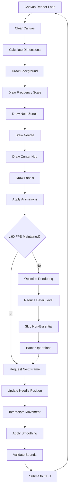

## 🎵 Sistema de Notas Interactivo

```mermaid
graph TB
    A[Note Display System] --> B[Grid Generator]
    A --> C[State Manager]
    A --> D[Visual Effects]
    A --> E[Event Handler]
    
    B --> B1[12 Notes per Octave]
    B --> B2[Multi-Octave Support]
    B --> B3[Responsive Layout]
    B --> B4[Accessibility Labels]
    
    C --> C1[Inactive State]
    C --> C2[Near State - Orange]
    C --> C3[Close State - Yellow]
    C --> C4[Exact State - Green]
    C --> C5[Active Animation]
    
    D --> D1[Pulse Animation]
    D --> D2[Glow Effects]
    D --> D3[Scale Transforms]
    D --> D4[Color Transitions]
    
    E --> E1[Note Activation]
    E --> E2[Precision Updates]
    E --> E3[Statistics Tracking]
    E --> E4[Reset Functions]
```

## ⚡ Animaciones y Transiciones

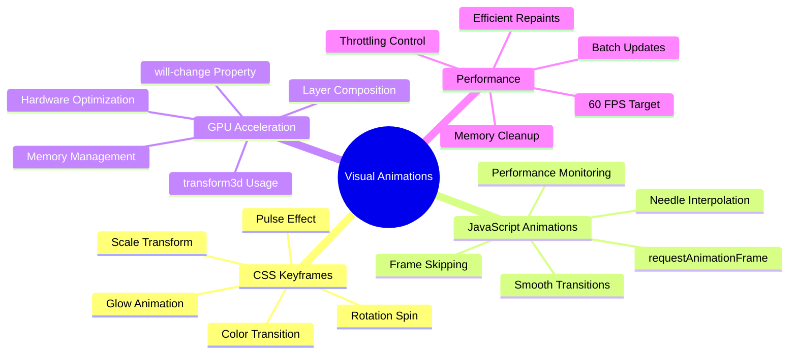

## 🎯 Estados Visuales del Medidor

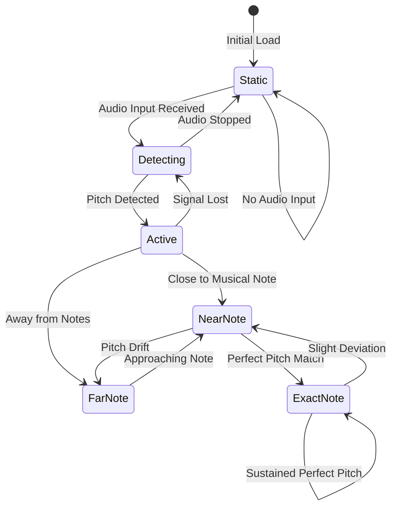

## 📊 Sistema de Métricas de Rendimiento

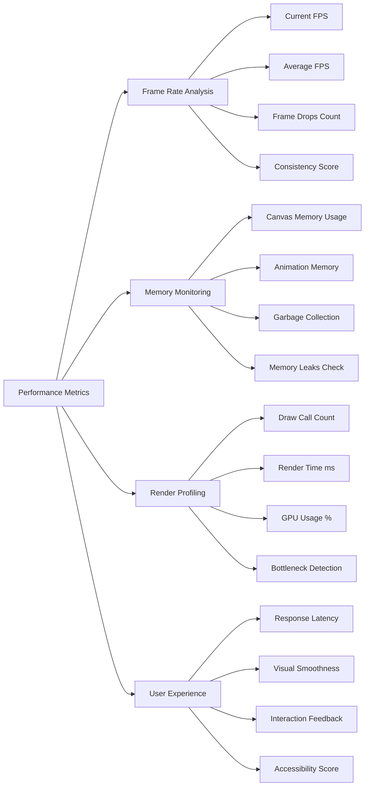

## 🎨 Paleta de Colores y Temas

```mermaid
graph TB
    A[Color System] --> B[Note Colors 12-Set]
    A --> C[State Colors]
    A --> D[UI Theme Colors]
    A --> E[Accessibility Colors]
    
    B --> B1[C: #FF6B6B Red]
    B --> B2[C#: #FF8E53 Orange]
    B --> B3[D: #FF9F43 Yellow-Orange]
    B --> B4[D#: #FFB347 Yellow]
    B --> B5[E: #A8E6CF Light Green]
    B --> B6[F: #4ECDC4 Cyan]
    B --> B7[F#: #45B7D1 Light Blue]
    B --> B8[G: #96CEB4 Mint]
    B --> B9[G#: #FFEAA7 Light Yellow]
    B --> B10[A: #DDA0DD Plum]
    B --> B11[A#: #FFB6C1 Light Pink]
    B --> B12[B: #E17055 Red-Orange]
    
    C --> C1[Success: #4CAF50]
    C --> C2[Warning: #FF9800]
    C --> C3[Error: #F44336]
    C --> C4[Info: #2196F3]
    
    D --> D1[Primary: #2196F3]
    D --> D2[Background: #1A1A1A]
    D --> D3[Surface: #2D2D2D]
    D --> D4[Text: #FFFFFF]
    
    E --> E1[High Contrast Mode]
    E --> E2[Color Blind Support]
    E --> E3[Reduced Motion]
    E --> E4[Focus Indicators]
```

## 🧪 Test Cases Visuales

| Test Case | Component | Action | Expected Visual | Pass Criteria |
|-----------|-----------|--------|----------------|---------------|
| **Canvas Render** | Circular Meter | Initial Load | Static meter display | Clean render, no artifacts |
| **Needle Movement** | Meter Needle | Frequency input | Smooth rotation | 60fps, no stuttering |
| **Note Activation** | Note Buttons | Pitch detection | Color change + glow | <100ms response time |
| **Precision Bar** | Indicator | Cents calculation | Position update | Smooth interpolation |
| **Animations** | All CSS | State changes | Keyframe execution | No frame drops |

## 🔄 Flujo de Test de Visualización

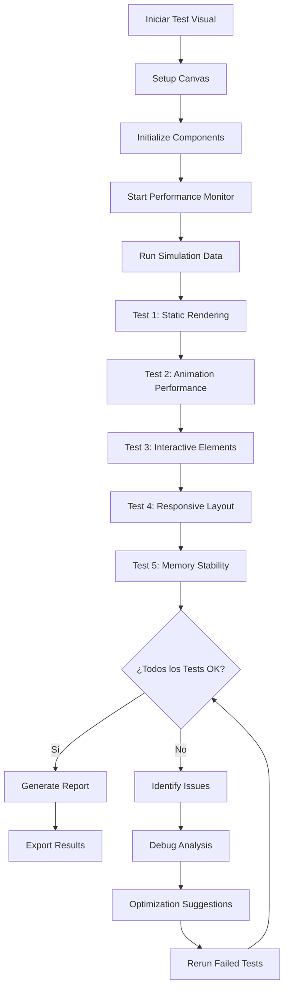

## 📱 Responsive Design Testing

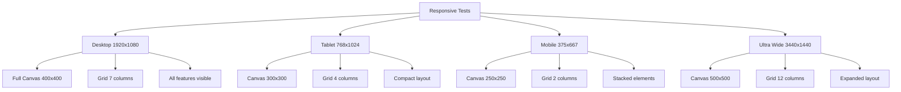

## 🎮 Simulación de Datos de Test

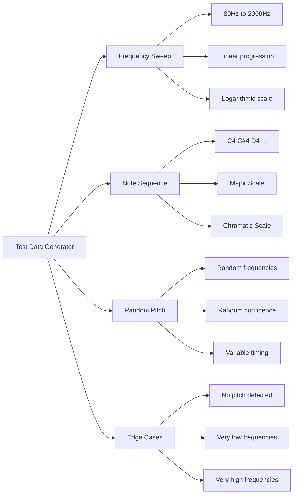

## 🔍 Debugging Visual Components

```mermaid
graph TB
    A[Visual Debugging] --> B[Canvas Inspector]
    A --> C[Animation Profiler]
    A --> D[Performance Analyzer]
    A --> E[Accessibility Checker]
    
    B --> B1[Draw Call Visualization]
    B --> B2[Render Layer Analysis]
    B --> B3[Pixel Perfect Check]
    B --> B4[Context State Monitor]
    
    C --> C1[Keyframe Timeline]
    C --> C2[Transition Timing]
    C --> C3[GPU Layer Usage]
    C --> C4[Composite Operations]
    
    D --> D1[FPS Graph Real-time]
    D --> D2[Memory Usage Plot]
    D --> D3[Render Time Histogram]
    D --> D4[Bottleneck Identification]
    
    E --> E1[Color Contrast Check]
    E --> E2[Focus Indicator Test]
    E --> E3[Screen Reader Support]
    E --> E4[Motion Reduction Test]
```

## 📊 Métricas de Éxito Visual

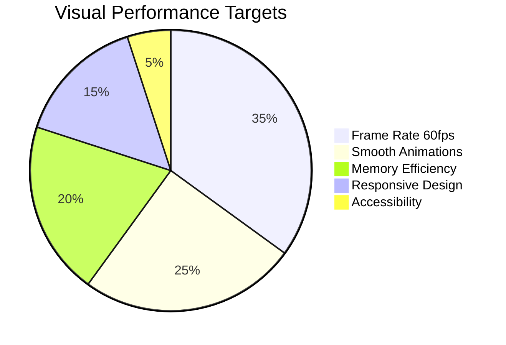

## ⚡ Optimizaciones Implementadas

- **🎯 RequestAnimationFrame**: Sincronización con refresh rate del monitor
- **🚀 GPU Acceleration**: Uso de transform3d y will-change
- **📦 Batch Operations**: Agrupación de operaciones de dibujo
- **🧠 Smart Caching**: Cache de elementos estáticos
- **⚡ Throttling**: Control de frecuencia de actualizaciones
- **🔧 Level-of-Detail**: Reducción de detalle en bajo rendimiento

## 🎯 Criterios de Éxito Visualización

- ✅ **Frame Rate**: 60fps sostenidos durante 5 minutos
- ✅ **Memoria**: <100MB uso total, sin memory leaks
- ✅ **Respuesta**: <50ms latencia en interacciones
- ✅ **Suavidad**: Animaciones fluidas sin stuttering
- ✅ **Precisión**: Renderizado pixel-perfect en todas las resoluciones
- ✅ **Accesibilidad**: WCAG 2.1 AA compliance

---

**Última actualización**: Julio 2025  
**Versión**: 1.0  
**Componentes**: Canvas 2D + CSS Animations + Interactive Elements
